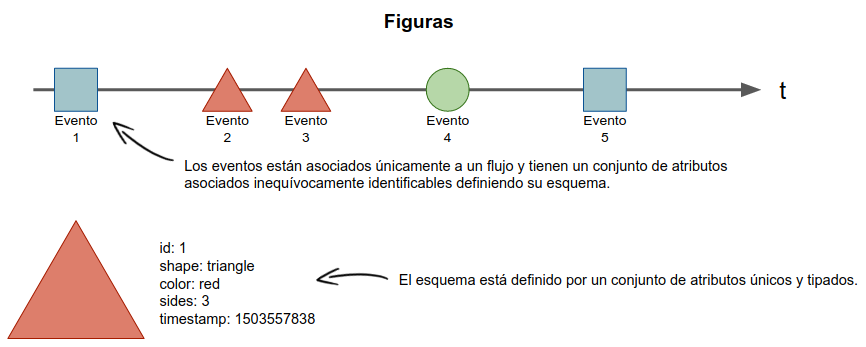

== Capítulo 2: Correlación de Eventos Complejos

En este capítulo introduciremos algunos conceptos básicos sobre la correlación de eventos complejos. En primer lugar definiremos los conceptos básicos y elementos.

=== Flujo de eventos

Siddhi utiliza el concepto de flujo de eventos para referirse a una secuencia de eventos ordenados en el tiempo con un esquema de atributos definido. Uno o varios de estos eventos pueden ser importados y manipulados usando consultas para identificar condiciones de eventos complejos. Estas consultas generarán nuevos eventos que son notificados como respuesta.

Un flujo de eventos está identificado por un nombre y tiene un conjunto de atributos asociados inequívocamente identificables, definiendo su esquema. Los atributos tienen un nombre único dentro del flujo de eventos y pueden ser de los siguientes tipos: `string`, `int`, `long`, `float`, `double`, `bool` u `object`.

Los eventos están asociados únicamente a un flujo y tienen un conjunto de atributos idénticos con tipos específicos. Un evento debe contener una marca de tiempo y los atributos de acuerdo a su esquema.

.Flujo de eventos

TIP: Supongamos que definimos un flujo de eventos llamado "*figuras*" (Véase **Figure 1**) en el cuál se irá recibiendo una figura aleatoria a lo largo del tiempo. Un esquema válido para este flujo sería: figura = { id: int, shape: string, color: string, sides: int, timestamp: long }
