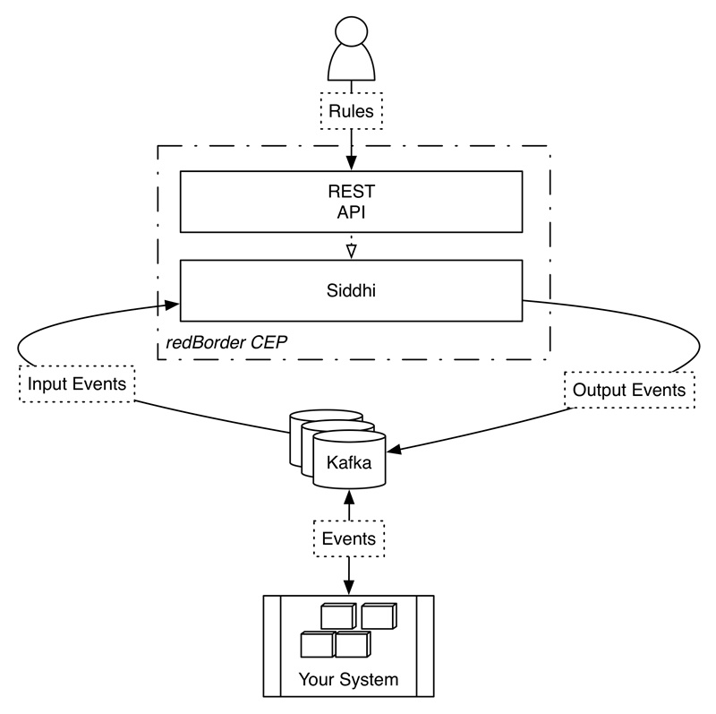

== Capítulo 1: Introducción a redBorder CEP

En este capítulo daremos una breve introducción a redBorder CEP y a su arquitectura.

=== RedBorder CEP

Un procesador de eventos complejos o CEP (De sus siglas en inglés: Complex Event Processing), es un procesador de eventos que combina los datos de varias fuentes para inferir eventos o patrones que sugieran las circunstancias más complejas.

redBorder CEP permite la ejecución de un conjunto de reglas, las cuales pueden inferir eventos, patrones y secuencias. Dispone de una API Rest a través de la cual un usuario puede añadir, eliminar o listar las reglas en tiempo real.

.Arquitectura de redBorder CEP

El motor encargado de realizar las funciones del CEP es Siddhi. Siddhi CEP es un motor de procesamiento de eventos complejos en tiempo real creado por WSO2 ligero y fácil de usar escrito en Java bajo licencia Apache v2.0. Siddhi puede recibir eventos de fuentes externas y analizarlos en base a las especificaciones del usuario para posteriormente notificar los eventos apropiados.

En la arquitectura de redBorder CEP los eventos consumidos por Siddhi provienen de uno o varios topics de entrada de Kafka. El resultado de los cálculos y eventos son insertados en un nuevo topic o conjunto de topics de Kafka.

Siddhi tiene muchas características entre ellas podemos destacar:

* Funciones de agregación como sumas, máximos, mínimos, media, desviación estándar y conteo.
* Filtro y proyección de consultas usando expresiones matemáticas y lógicas.
* Valores por defecto en los atributos.
* Funciones integradas utiles para el procesamiento de eventos como, por ejemplo, ventanas de tiempo.
* Renombrado de atributos

